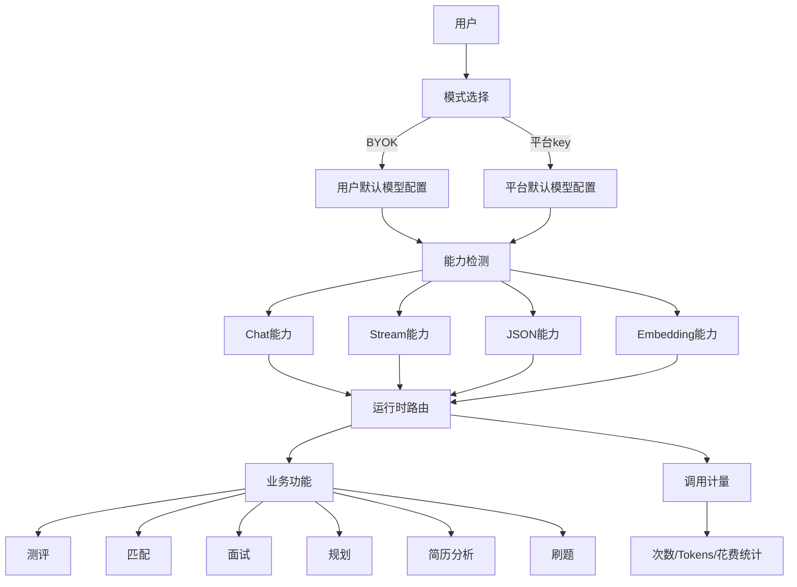

# AI Recruit Agent 商业计划书

## 目录

- [一、项目定位](#一项目定位)
- [二、核心产品价值](#二核心产品价值)
- [三、目标用户与市场场景](#三目标用户与市场场景)
- [四、商业模式设计](#四商业模式设计)
- [五、BYOK 模式详细方案](#五byok-模式详细方案)
- [六、平台托管模式详细方案](#六平台托管模式详细方案)
- [七、广告与增值服务策略](#七广告与增值服务策略)
- [八、产品能力与功能映射](#八产品能力与功能映射)
- [九、技术架构演进方案](#九技术架构演进方案)
- [十、计量、统计与计费思路](#十计量统计与计费思路)
- [十一、安全与合规要求](#十一安全与合规要求)
- [十二、风险与应对策略](#十二风险与应对策略)
- [十三、分阶段落地路线图](#十三分阶段落地路线图)
- [十四、现阶段建议结论](#十四现阶段建议结论)

---

## 一、项目定位

`AI Recruit Agent` 的核心定位不是“卖模型调用”，而是提供一套围绕职业成长与求职过程的智能工作流平台。

平台能力包括：

- AI 职业测评
- 人才画像生成
- 岗位匹配与突破认知推荐
- AI 模拟面试
- 职业发展规划
- 简历分析与优化建议
- 刷题练习与知识点记忆系统

因此，本项目的商业价值来源主要不是底层模型本身，而是：

- 结构化流程设计
- 跨功能数据联动
- 用户长期成长记录
- 可视化交互体验
- 平台级统计与管理能力

---

## 二、核心产品价值

相对于直接调用模型接口，本平台提供的是更高层的业务能力：

### 1. 职业决策闭环

用户可以从“认识自己”到“岗位匹配”再到“面试训练”和“职业规划”形成完整闭环，而不是只得到一次性回答。

### 2. 结构化结果沉淀

平台将大模型输出整理为可复用的数据资产，例如：

- 人才画像
- 匹配结果
- 面试评估报告
- 职业规划
- 简历分析报告
- 刷题统计与薄弱知识点

### 3. 持续记忆能力

平台可以记录用户长期的行为和结果，而不是每次重新开始。这对职业发展类产品非常重要。

### 4. 可商用的产品层能力

企业或个人用户愿意为：

- 工作流
- 管理后台
- 统计报表
- 团队协作
- 数据沉淀
- 结果解释能力

付费，而不仅仅是为“模型响应”付费。

---

## 三、目标用户与市场场景

### 1. C 端用户

- 校招生、应届生
- 转行求职者
- 在职用户的职业规划需求
- 技术岗位准备面试的用户

### 2. B 端用户

- 中小企业招聘团队
- 培训机构
- 职业教育平台
- 求职辅导机构

### 3. 典型使用场景

- 求职前做职业测评，确认方向
- 根据画像匹配岗位，发现新机会
- 面试前进行模拟面试
- 根据刷题数据调整职业规划
- 上传简历，快速获得优化建议

---

## 四、商业模式设计

本项目建议采用“双轨模式”：

### 模式 A：BYOK（Bring Your Own Key）

用户自行提供：

- API Key
- Base URL
- Model

平台负责：

- 工作流与交互
- 数据沉淀
- 结果展示
- 使用统计

用户自己承担模型调用费用。

### 模式 B：平台托管模式

用户不配置模型，直接使用平台提供的默认模型服务。

平台负责：

- 模型默认配置
- 调用稳定性
- 成本管理
- 计费与额度控制

平台可以按订阅、按量、积分或混合方式收费。

### 模式 C：广告与增值服务

后续可加入：

- 广告位
- 课程推荐
- 岗位推荐
- 简历优化增值服务
- 企业版服务

---

## 五、BYOK 模式详细方案

### 1. 定义

BYOK 用户自带模型配置，平台免费提供工作流能力，不代收模型成本。

### 2. 已确认规则

- 每个用户只保存 1 套默认模型配置
- 用户全局二选一：使用自己的 key 或使用平台 key
- BYOK 用户免费
- 只做使用统计，不做模型成本代收
- API Key 服务端加密存储
- 仅做基础反滥用限制，不做严格次数封顶

### 3. 适用人群

- 对模型有认知的个人用户
- 已有模型资源的团队
- 企业试用客户
- 成本敏感型高频用户

### 4. 优势

- 平台无需垫付模型费用
- 降低平台现金流压力
- 用户更容易接受
- 更适合接入企业自己的模型网关

### 5. 风险

- 接口兼容性不一致
- 用户配置错误较多
- 模型能力参差不齐
- 计量不一定等于真实账单

---

## 六、平台托管模式详细方案

### 1. 定义

平台统一提供默认模型配置，用户无需关心模型供应商、Key、Base URL 等问题。

### 2. 平台价值

- 开箱即用
- 更少的技术门槛
- 更稳定的体验
- 更易于计费和支持

### 3. 收费方式

当前讨论结果是“先设计成可扩展”，未来可以支持：

- 预充值
- 月度/年度订阅
- 按量计费
- 混合计费

### 4. 推荐策略

第一阶段不要过早锁死计费模型，先把底层统计系统搭好，再根据真实使用数据决定套餐设计。

---

## 七、广告与增值服务策略

广告不建议插入高专注流程中，例如：

- 测评中
- 面试中
- 刷题答题中

更适合放在：

- 首页资讯区
- 学习资源推荐区
- 职业发展内容页
- 岗位推荐流

增值服务建议包括：

- 简历深度优化服务
- 岗位一对一辅导
- 面试报告导出
- 企业招聘后台
- 团队版/机构版

---

## 八、产品能力与功能映射

不同功能对模型能力要求不同，需要在系统中做能力映射。

### 功能依赖矩阵

- 测评：`chat + json`
- 匹配：`chat + json + embedding`
- 面试：`chat + stream + json`
- 规划：`chat + json + embedding`
- 简历分析：`chat + json`
- 刷题：`chat + json`

### 关键规则

- 如果用户配置的 provider/model 不支持某项能力，则该功能禁用
- 只提示用户更换 `base_url/model`
- 不自动回退到平台 key，避免产生误收费

### Embedding 特殊说明

岗位匹配和职业规划高度依赖 embedding。

如果用户自带的 provider/model 不支持 embedding：

- 匹配功能不可用
- 规划功能不可用
- 系统必须明确提示原因

---

## 九、技术架构演进方案

### 当前状态

目前系统仍以单套全局模型配置为主，未来要改造成“用户级模型配置”。

### 目标架构

### 需要新增的核心表

#### 1. `user_model_configs`

建议字段：

- `user_id`
- `mode`
- `base_url`
- `model`
- `api_key_encrypted`
- `supports_chat`
- `supports_stream`
- `supports_json`
- `supports_embedding`
- `last_test_status`
- `last_test_error`
- `updated_at`

#### 2. `usage_records`

建议字段：

- `user_id`
- `mode`
- `feature`
- `provider_or_base_url`
- `model`
- `request_tokens`
- `response_tokens`
- `total_tokens`
- `estimated_cost`
- `success`
- `error_code`
- `latency_ms`
- `created_at`

---

## 十、计量、统计与计费思路

### 1. BYOK 用户

只做统计，不做代收：

- 调用次数
- 各功能使用次数
- token 数
- 估算花费或空值

注意：由于不同 provider 计费规则不同，BYOK 的花费统计更适合作为“估算参考”，不适合作为正式结算依据。

### 2. 平台 key 用户

未来可做正式计费，底层仍然共用同一套 `usage_records` 数据结构。

### 3. 第一版建议展示

第一版后台只展示：

- 调用次数
- tokens 数
- 花费

不必一开始就做复杂账单、发票、跨 provider 对账。

---

## 十一、安全与合规要求

### 1. 密钥安全

- API Key 只能服务端保存
- 必须加密存储
- 前端只显示掩码
- 日志中不得打印密钥

### 2. 数据安全

- 简历、画像、面试报告等属于敏感职业数据
- 需要持久化、访问控制和删除机制
- 生产环境中应使用密钥管理服务而不是明文 `.env`

### 3. 平台安全

即使 BYOK 免费，也必须保留基础反滥用能力：

- 并发限制
- 文件大小限制
- 异常请求频率限制
- 长时请求超时控制

### 4. 法律合规

需要准备：

- 用户协议
- 隐私政策
- AI 结果免责声明
- 数据存储与删除规则

---

## 十二、风险与应对策略

### 风险 1：任意 base_url 带来的兼容性问题

应对：

- 对外统一定义为“支持 OpenAI-compatible 接口”
- 新增配置测试页
- 保存前先跑能力检测

### 风险 2：BYOK 免费导致平台资源被过度消耗

应对：

- 保留基础风控
- 限制异常高频行为
- 限制大文件与长连接资源占用

### 风险 3：用户误以为系统自动回退平台 key

应对：

- 明确禁止自动回退
- 不支持时只提示用户更换 provider/model

### 风险 4：真实成本与统计不一致

应对：

- BYOK 只做参考统计
- 平台托管模式再做正式成本结算

---

## 十三、分阶段落地路线图

### 第一阶段：最小商用闭环

- 用户级模型配置
- 加密存储 API Key
- 配置测试与能力检测
- 按用户配置实例化模型客户端
- 使用统计基础版

### 第二阶段：产品化增强

- 模型设置页
- 使用统计页
- 功能能力提示
- 平台 key 与 BYOK 双模式切换

### 第三阶段：商业化增强

- 平台 key 付费模式
- 套餐与额度
- 管理后台
- 更细粒度的报表

### 第四阶段：增长与企业化

- 企业团队账号
- 组织级统计
- 广告位与内容推荐
- 高级增值服务

---

## 十四、现阶段建议结论

结合当前项目阶段，最推荐的商业化方向是：

### 第一优先

先做：

- BYOK 免费
- 平台 key 托管
- 用户级模型配置
- 能力检测
- 调用统计

### 第二优先

再做：

- 平台 key 计费
- 套餐与额度
- 管理后台

### 第三优先

最后再做：

- 企业版
- 广告变现
- 更复杂的商业模型

### 最终建议

一句话总结：

> BYOK 免费，卖的是职业 AI 工作流平台；平台托管收费，卖的是开箱即用的模型服务体验。

这是当前阶段最合理、风险最低、最容易落地的商业化路径。

